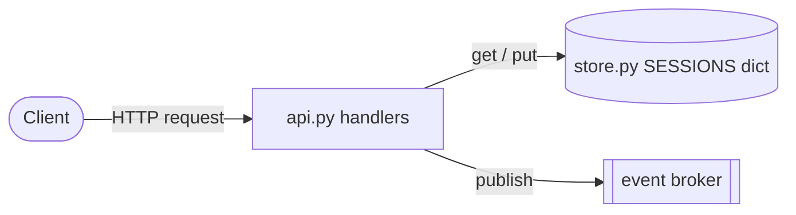

# One request, end to end

Describes the code on `main` as deployed, commit `a1b2c3d`.

Shapes: stadium is an external actor, rectangle is a service of ours, cylinder is a data store, subroutine is a queue. A solid edge is a synchronous call; a dotted edge is asynchronous.

